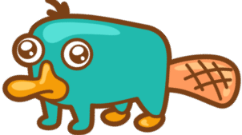

  

## 👋 Hi there, I'm Nathan!

I'm a computer engineering student, currently exploring different areas of software development.

I enjoy discovering new tools, experimenting with technologies, and building projects whenever I find the time.

### 🛠️ Languages & Tools

#### Programming Languages

### 🌱 Currently learning
- Trying out new tools and frameworks
- Rust programming language

### 🚀 Goals
- Build more personal projects
- Learn from open-source contributions

